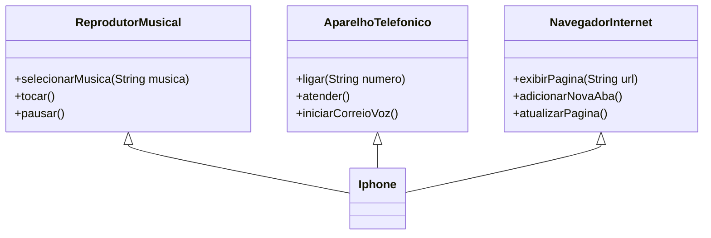

# :iphone: Desafio: Modelando o iPhone com UML
Projeto realizado no Bootcamp Santander Back-End e têm como proposta a criação de um método contador e uma classe Exception customizada. 

Projeto realizado no Bootcamp Santander Back-End e têm como proposta a criação de um diagrama UML com as funcionalidades do iPhone e implementar no Java essas funções. 

A classe Iphone implementa três interfaces: ReprodutorMusical, AparelhoTelefonico, NavegadorInternet. As interfaces possuem três métodos abstratos cada uma.

A classe Main executa o código exibindo no terminal um menu de opções para cada função. As funções imprimem uma mensagem apenas para simular seu funcionamento.

## Diagrama UML

